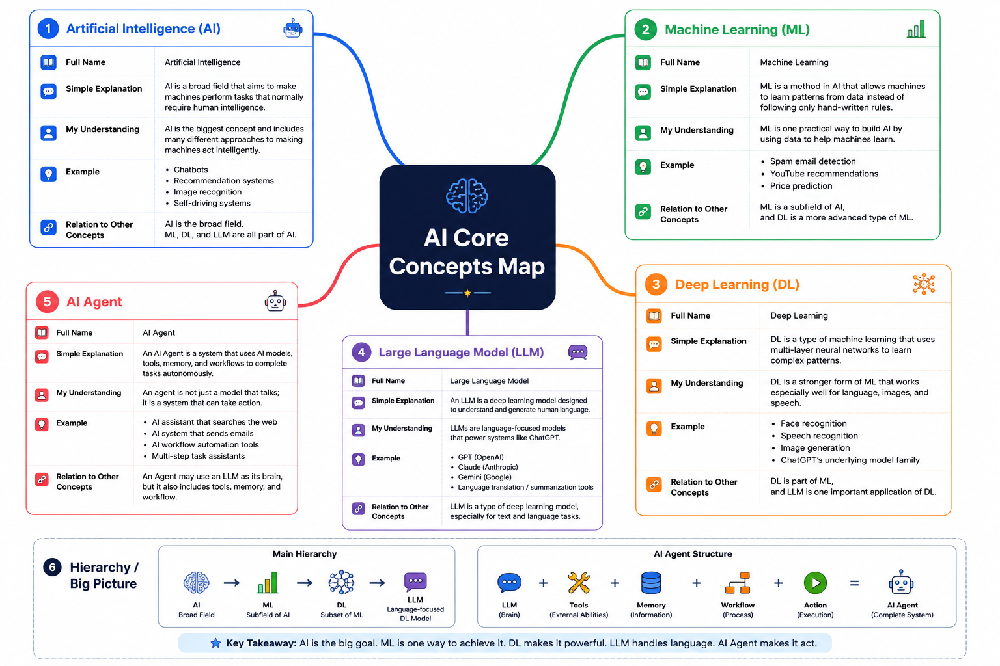

# Week 1 AI Map

## 1. Artificial Intelligence (AI)

**Full Name:** Artificial Intelligence

**Explanation:**  
Artificial Intelligence is a broad field that aims to make machines perform tasks that normally require human intelligence.

**My Understanding:**  
AI is the biggest concept and includes many different ways to build intelligent systems.

**Example:**  
- Chatbots  
- Recommendation systems  
- Image recognition  
- Self-driving systems  

**Relation to Other Concepts:**  
AI is the broad field. Machine Learning, Deep Learning, and LLMs are all part of AI.

---

## 2. Machine Learning (ML)

**Full Name:** Machine Learning

**Explanation:**  
Machine Learning is a method in AI that allows machines to learn patterns from data instead of following only hand-written rules.

**My Understanding:**  
ML is one practical way to build AI by using data to help machines learn.

**Example:**  
- Spam email detection  
- YouTube recommendations  
- Price prediction  

**Relation to Other Concepts:**  
ML is a subfield of AI, and Deep Learning is a more advanced type of ML.

---

## 3. Deep Learning (DL)

**Full Name:** Deep Learning

**Explanation:**  
Deep Learning is a type of machine learning that uses multi-layer neural networks to learn complex patterns.

**My Understanding:**  
DL is a stronger form of ML that works especially well for language, images, and speech.

**Example:**  
- Face recognition  
- Speech recognition  
- Image generation  
- ChatGPT's underlying model family  

**Relation to Other Concepts:**  
DL is part of ML, and LLM is one important application of DL.

---

## 4. Large Language Model (LLM)

**Full Name:** Large Language Model

**Explanation:**  
A Large Language Model is a deep learning model designed to understand and generate human language.

**My Understanding:**  
LLMs are language-focused models that power systems like ChatGPT.

**Example:**  
- GPT  
- Claude  
- Gemini  
- Translation and summarization tools  

**Relation to Other Concepts:**  
LLM is a type of deep learning model, especially for text and language tasks.

---

## 5. AI Agent

**Full Name:** AI Agent

**Explanation:**  
An AI Agent is a system that uses AI models, tools, memory, and workflows to complete tasks autonomously.

**My Understanding:**  
An agent is not just a model that talks. It is a system that can take action.

**Example:**  
- AI assistants that search the web  
- AI systems that send emails  
- Workflow automation tools  
- Multi-step task assistants  

**Relation to Other Concepts:**  
An Agent may use an LLM as its brain, but it also includes tools, memory, and workflow.

---

## Big Picture

AI → ML → DL → LLM

AI Agent = LLM + Tools + Memory + Workflow + Action
